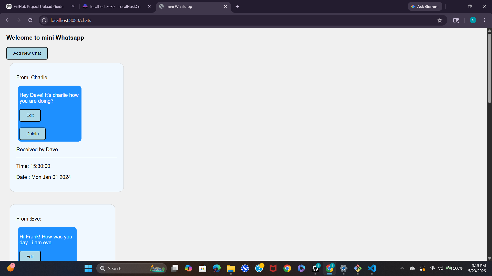
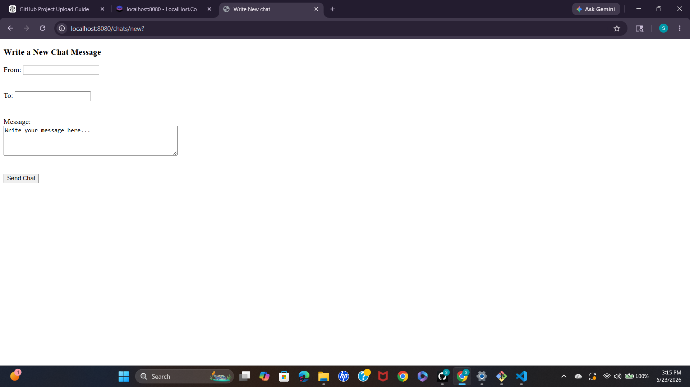

# 💬 Chat Application

A basic real-time chat application inspired by WhatsApp, developed using MongoDB, JavaScript, HTML, CSS, and Node.js. The application allows users to send and receive messages with a clean and responsive user interface while securely storing chat data in the database.

---

# 🚀 Features

- 💬 Real-time messaging interface
- 👤 User-friendly chat layout
- 🗄️ MongoDB database integration
- ✏️ Create and manage chats
- 📱 Responsive design
- ⚡ Fast and lightweight application
- 🎨 Simple and clean UI inspired by WhatsApp

---

# 🛠️ Tech Stack

- HTML5
- CSS3
- JavaScript
- Node.js
- Express.js
- MongoDB
- EJS

---

# 📂 Project Structure

```bash
Chat_Application/
│
├── models/
├── node_modules/
├── public/
├── views/
├── index.js
├── init.js
├── package.json
├── package-lock.json
└── README.md
```


# ⚙️ Installation & Setup

# Clone the repository
git clone https://github.com/Simran092004/chat.git

# Move into project folder
cd chat

# Install dependencies
npm install

# Start the server
node index.js

---

# 🌐 Run Locally

After running the server, open your browser and visit:

```bash
http://localhost:3000
```

---

# 🎯 Functionalities

- Send messages
- Store chat data in MongoDB
- Display chat history
- Responsive chat interface
- Simple CRUD operations

---

# 📸 Screenshots

## 🏠 Home Page


## 💬 Edit Chat


## ✏️ Create Chat


---

# 🎓 Learning Outcomes

Through this project, I learned:

- Backend development with Node.js
- MongoDB database operations
- Express.js routing
- CRUD operations
- EJS templating
- Responsive UI design
- Full-stack project structure

---

# 🔮 Future Improvements

- Add user authentication
- Add real-time communication using Socket.io
- Add file/image sharing
- Add online/offline status
- Add typing indicators
- Add dark mode

---

# 👨‍💻 Author

### Simran
B.Tech Student | Full Stack Developer

GitHub:
https://github.com/Simran092004

---

# ⭐ Support

If you like this project, give it a ⭐ on GitHub.
````
